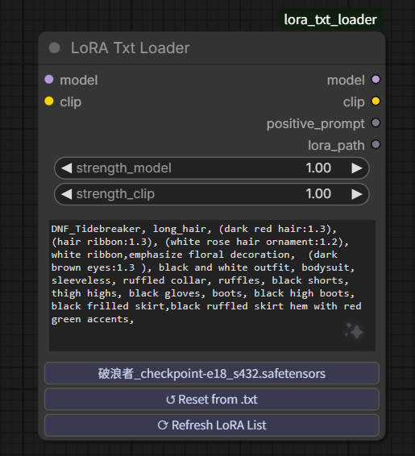
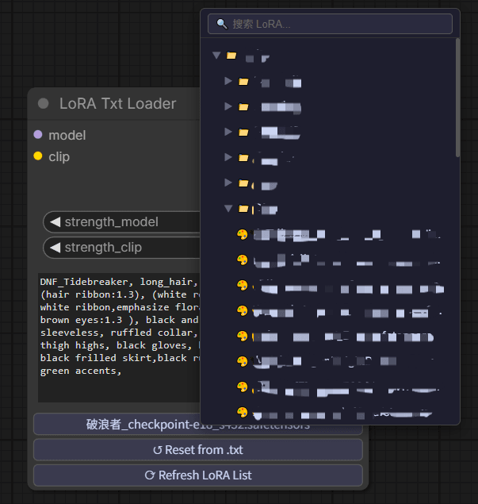
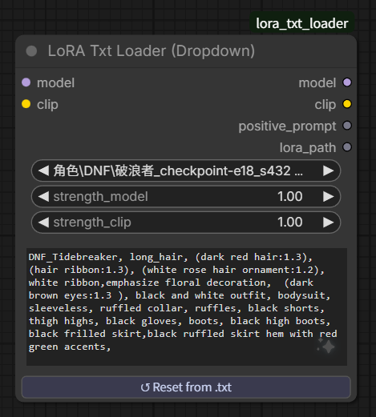
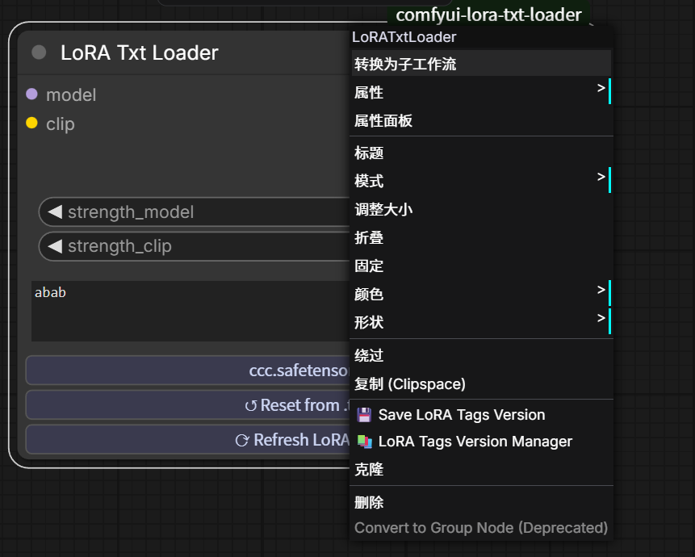

# LoRA Txt Loader — ComfyUI Custom Node

A ComfyUI custom node that loads LoRA trigger words from a **local `.txt` file** — fully offline, fully customizable, no metadata dependency.

## Preview

### LoRA Txt Loader — Tree Browser


The main node with trigger words auto-loaded from a `.txt` file. Click the LoRA name button to open the tree browser. Right-click to manage tag versions.

### Tree-Style Folder Browser


Browse thousands of LoRAs in a collapsible tree panel. Only one folder per level expands at a time (accordion behavior). Built-in search filters across all files instantly.

### LoRA Txt Loader (Dropdown)


The dropdown variant — same auto-fill behavior, classic ComfyUI interface.

## How It's Different

Most existing LoRA loader nodes get trigger words from one of two sources:

- **Model metadata** baked into the `.safetensors` file (often incomplete or missing entirely)
- **Civitai API** — requires internet access, and only works for models publicly hosted on Civitai

**LoRA Txt Loader takes a different approach.**

You maintain a plain `.txt` file next to each LoRA, and the node reads from it directly. This means:

- Works completely **offline**
- Works for **self-trained models** that have never been uploaded anywhere
- Trigger words are **exactly what you wrote** — no guessing, no scraping
- You're in full control

## Features

- 📁 **Tree-style folder browser** — browse your LoRA folders in a collapsible tree panel, with accordion behavior so only one folder opens at a time, keeping the view clean
- 🔍 **Built-in search** — type to filter across all LoRAs instantly, supports up to 10,000+ files without lag
- 📌 **Remembers your position** — reopening the panel automatically expands and scrolls to your currently selected LoRA
- 📄 **Auto-loads trigger words** from a `.txt` file with the same name as the LoRA
- ✏️ **Editable text box** — modify trigger words directly in the node before running
- 🔄 **Auto-fills on LoRA switch** — when you select a different LoRA, the text box updates automatically
- ↩️ **Reset button** — one click to restore the original `.txt` content if you've edited it
- ⟳ **Refresh button** — reload the LoRA list without restarting ComfyUI (useful after downloading new LoRAs)
- 📐 **Remembers node size** — manually resizing the node is preserved when switching LoRAs
- 🔌 **Drop-in replacement** for the native Load LoRA node — same inputs, same outputs, plus extras
- 🏷️ **Tag version management** — save, activate, and manage multiple versions of LoRA trigger words with custom names and notes

## New: LoRA Tag Version Management



Right-click on a LoRA to save, manage, and switch between different versions of trigger words (tags).

### How It Works

Right-click menu options:
- **Save LoRA Tags Version** — Save current prompt text as a new version
- **LoRA Tags Version Manager** — Open the version manager to view, activate, or delete versions

### File Structure

Versions are stored in a `[lora_name].versions/` folder alongside the LoRA model:

```
my_character.safetensors
my_character.txt              ← Currently active version (always same as LoRA name)
my_character.versions/
├── manifest.json            ← Version metadata
├── _original.txt            ← Default version (from original my_character.txt)
├── 2026-06-30 22-02-38_v1.txt
├── 2026-06-30 22-02-42_v2.txt
└── 2026-06-30 22-03-08_v3.txt
```

- **_original.txt** — the default version (what was in the original `.txt` file)
- **YYYY-MM-DD HH-MM-SS_versionname.txt** — custom versions with timestamp and name
- **manifest.json** — stores version names, notes, and metadata
- **my_character.txt** — always represents the currently active version

### First Time Setup (No Versions Yet)

**Scenario A:** LoRA has a corresponding `.txt` file and it's not empty
- The `.txt` content is automatically saved as `_original.txt` in the `.versions/` folder (the **default version**)
- You can now create additional custom versions

**Scenario B:** No `.txt` file or `.txt` is empty
- The **current text in the text box** is saved as `_original.txt` (the **default version**)
- Then you can add more versions

### Managing Versions

Once you have at least one version saved:

1. **Right-click on the LoRA** → **"Save LoRA Tags Version"** to create a new version
   - Enter a custom version name
   - System creates: `YYYY-MM-DD HH-MM-SS_versionname.txt` in the `.versions/` folder
   - Add optional notes/description (stored in `manifest.json`)
   
2. **Version Manager** → Access all saved versions:
   - **Activate** a version to make it active (the version's content is copied to `my_character.txt`)
   - **Delete** a version (cannot delete the currently active or default `_original.txt`)

3. **Switching versions**:
   - Activating a version replaces the same-named `.txt` file (e.g., `my_character.txt`) with that version's content
   - After switching versions, click **Refresh LoRA** to update the downstream **LoRA Txt Loader (Dropdown)** node if you're using it
   - The node always reads from the same-named `.txt` file

### Example Workflow

```
LoRA: my_character.safetensors
├── Default Version (_original.txt)
│   └── "white hair, blue eyes, school uniform"
├── Version: Summer Outfit (2026-06-30 22-02-38_Summer_Outfit.txt)
│   └── "white hair, blue eyes, summer dress"
└── Version: Winter Outfit (2026-06-30 22-02-42_Winter_Outfit.txt)
    └── "white hair, blue eyes, winter coat, scarf"
```

Switch between versions as needed — each saves your custom trigger words separately.

## Nodes

### 1. LoRA Txt Loader *(recommended)*
The main node. Uses a **tree-style folder browser** with built-in search to select a LoRA. Click a folder to expand/collapse it — only one folder per level stays open at a time. Auto-fills the prompt text box from the adjacent `.txt` file. Includes a Reset button and a Refresh button to pick up newly downloaded LoRAs without restarting ComfyUI. Right-click to manage trigger word versions.

### 2. LoRA Txt Loader (Dropdown)
Same as above but uses the **standard ComfyUI dropdown** instead of the tree browser. Useful if you prefer the classic interface.

### 3. LoRA Txt Loader (From Path)
Takes a **direct file path string** as input instead of a dropdown. Useful for dynamic workflows where the LoRA path is generated by another node. Reads trigger words from the adjacent `.txt` file automatically.

| Input | Description |
|-------|-------------|
| `model` | Connect from checkpoint loader |
| `clip` | Connect from checkpoint loader |
| `lora_path` | Full path to the `.safetensors` file |
| `strength_model` | LoRA model strength |
| `strength_clip` | LoRA CLIP strength |

### 4. Txt File Loader
Loads a standalone `.txt` file from the `ComfyUI/input/texts/` folder into an editable text box. Useful for storing reusable prompt snippets, style templates, or shared trigger word sets separately from any specific LoRA.

Place your `.txt` files in:

```
ComfyUI/input/texts/
├── my_style.txt
├── base_prompt.txt
└── ...
```

## Installation

```bash
cd ComfyUI/custom_nodes
git clone https://github.com/kwokkakiu233/comfyui-lora-txt-loader
```

Restart ComfyUI after installation.

## Usage

### 1. Prepare your `.txt` files

Place a `.txt` file with the same base name as your LoRA in the same folder:

```
ComfyUI/models/loras/
├── my_character.safetensors
├── my_character.txt          ← trigger words go here
├── subfolder/
│   ├── my_pose.safetensors
│   └── my_pose.txt
```

The `.txt` file can contain anything — single tags, comma-separated words, full prompt snippets, whatever works for your workflow.

### 2. Add the node

Find it under `loaders` → **LoRA Txt Loader**

### 3. Connect and use

| Input | Description |
|-------|-------------|
| `model` | Connect from checkpoint loader |
| `clip` | Connect from checkpoint loader |
| `lora_name` | Click to open the tree browser and select a LoRA |
| `strength_model` | LoRA model strength |
| `strength_clip` | LoRA CLIP strength |
| `positive_prompt` | Auto-filled from `.txt`; edit freely |

| Output | Description |
|--------|-------------|
| `model` | Patched model |
| `clip` | Patched CLIP |
| `positive_prompt` | Your (edited) trigger words — connect to downstream text nodes |
| `lora_path` | Full path to the loaded LoRA file |

### 4. Using `positive_prompt` in your workflow

The `positive_prompt` output is a plain string — you can wire it into your workflow in several ways:

**Option A — Direct encode** *(simplest)*
Connect `positive_prompt` directly to a **CLIP Text Encode** node. The trigger words become your entire positive prompt.

**Option B — Append to a base prompt** *(recommended)*
Use a **Text Concatenate** node to merge trigger words with your own prompt:

```
[Your base prompt] + [positive_prompt from LoRA Txt Loader]
        ↓
  Text Concatenate
        ↓
  CLIP Text Encode
        ↓
    KSampler (positive)
```

This lets you write a scene description once and swap LoRAs freely without rewriting your prompt each time.

**Option C — Convert to conditioning**
Feed the output into a **Text to Conditioning** node if your workflow uses a conditioning-based pipeline.

### 5. Refresh without restarting

After downloading a new LoRA, click **⟳ Refresh LoRA List** on the node. The tree browser will immediately include the new file — no need to restart ComfyUI.

### 6. Managing Tag Versions

Right-click on any LoRA to:
- **Save LoRA Tags Version** — create a new version of trigger words with a custom name and optional notes
- **LoRA Tags Version Manager** — view, activate, or delete existing versions

See [LoRA Tag Version Management](#new-lora-tag-version-management) section above for details.

## Why a `.txt` file?

If you train your own LoRAs, you already know what triggers them — the metadata inside the file is often empty or auto-generated garbage. A plain text file is the simplest possible way to keep notes next to a model. No tools required, editable in Notepad, survives any model conversion or re-export.

## Bug Fixes

### v1.x
- Fixed: **Txt File Loader** node now correctly locates `.txt` files in some edge cases where the file lookup previously failed

## Requirements

- ComfyUI (Desktop or server version)
- Python 3.x (included with ComfyUI)
- No additional dependencies

## License

MIT